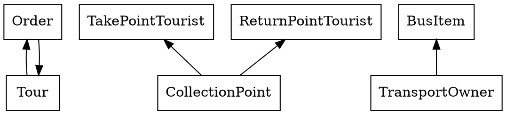

# 实验准备

```dot
digraph g {

	overlap=false;
	rankdir = BT;
	node [shape=record];
	subgraph Atlantis {
		Tour;
		Order;
		CollectionPoint;
		TakePointTourist;
		TransportOwner;
		BusItem;
		ReturnPointTourist;

		Tour -> Order[label="" len=4.00];
		Order -> Tour[label="" len=4.00];
		CollectionPoint -> TakePointTourist[label="" len=4.00];
		TransportOwner -> BusItem[label="" len=4.00];
		CollectionPoint -> ReturnPointTourist[label="" len=4.00];
	}
}
```
sfsfsdfsdfsdff
fsfsfd

```dot
digraph g {

	overlap=false;
	rankdir = BT;
	node [shape=record];
	subgraph Atlantis {
		Tour;
		Order;
		CollectionPoint;
		TakePointTourist;
		TransportOwner;
		BusItem;
		ReturnPointTourist;

		Tour -> Order[label="" len=4.00];
		Order -> Tour[label="" len=4.00];
		CollectionPoint -> TakePointTourist[label="" len=4.00];
		TransportOwner -> BusItem[label="" len=4.00];
		CollectionPoint -> ReturnPointTourist[label="" len=4.00];
	}
}
```

