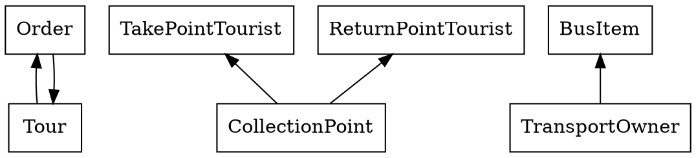

## 1.实验目的：

- 了解操作系统开发实验环境
- 熟悉命令行方式的编译、调试工程
- 掌握基于硬件模拟器的调试技术
- 熟悉C语言编程和指针的概念
- 了解X86汇编语言

```dot
digraph g {

	overlap=false;
	rankdir = BT;
	node [shape=record];
	subgraph Atlantis {
		Tour;
		Order;
		CollectionPoint;
		TakePointTourist;
		TransportOwner;
		BusItem;
		ReturnPointTourist;

		Tour -> Order[label="" len=4.00];
		Order -> Tour[label="" len=4.00];
		CollectionPoint -> TakePointTourist[label="" len=4.00];
		TransportOwner -> BusItem[label="" len=4.00];
		CollectionPoint -> ReturnPointTourist[label="" len=4.00];
	}
}
```

```dot
digraph g {

	overlap=false;
	rankdir = BT;
	node [shape=record];
	subgraph Atlantis {
		Tour;
		Order;
		CollectionPoint;
		TakePointTourist;
		TransportOwner;
		BusItem;
		ReturnPointTourist;

		Tour -> Order[label="" len=4.00];
		Order -> Tour[label="" len=4.00];
		CollectionPoint -> TakePointTourist[label="" len=4.00];
		TransportOwner -> BusItem[label="" len=4.00];
		CollectionPoint -> ReturnPointTourist[label="" len=4.00];
	}
}
```

```dot
digraph g {

	overlap=false;
	rankdir = BT;
	node [shape=record];
	subgraph Atlantis {
		Tour;
		Order;
		CollectionPoint;
		TakePointTourist;
		TransportOwner;
		BusItem;
		ReturnPointTourist;

		Tour -> Order[label="" len=4.00];
		Order -> Tour[label="" len=4.00];
		CollectionPoint -> TakePointTourist[label="" len=4.00];
		TransportOwner -> BusItem[label="" len=4.00];
		CollectionPoint -> ReturnPointTourist[label="" len=4.00];
	}
}
```

