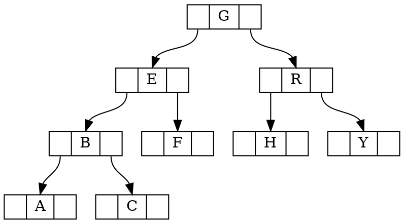

# 实验三：虚拟内存管理
做完实验二后，大家可以了解并掌握物理内存管理中的连续空间分配算法的具体实现以及如何建立二级页表。本次实验是在实验二的基础上，借助于页表机制和实验一中涉及的中断异常处理机制，完成Page
Fault异常处理和FIFO页替换算法的实现。实验原理最大的区别是在设计了如何在磁盘上缓存内存页，从而能够支持虚存管理，提供一个比实际物理内存空间“更大”的虚拟内存空间给系统使用。

